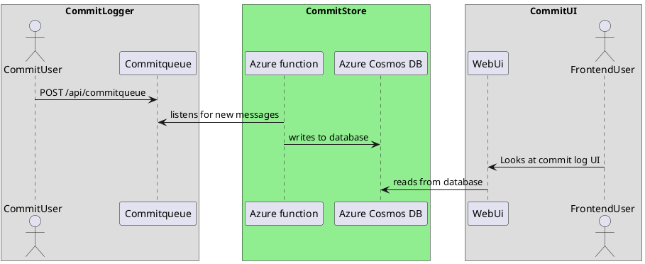

```plantuml
@startuml

box "CommitLogger"
Actor "CommitUser" as U
Participant "Commitqueue" as Q
end box
box "CommitStore" #LightGreen
Participant "Azure function" as F
Participant "Azure Cosmos DB" as Db
end box
box "CommitUI"
Participant "WebUi" as W
Actor "FrontendUser" as FU
end box
U -> Q: POST /api/commitqueue
F -> Q: listens for new messages
F -> Db : writes to database
FU -> W: Looks at commit log UI
W -> Db : reads from database
@enduml
```
