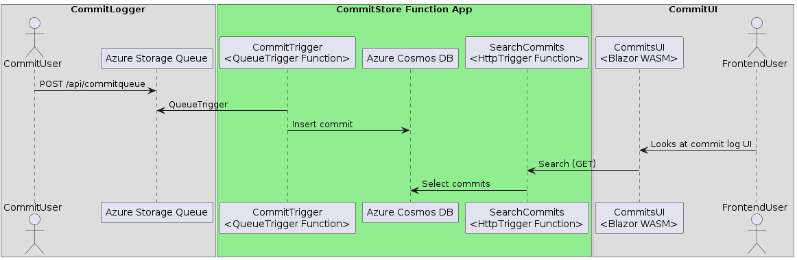

# CommitStore

This is the middle layer of the CommitStore system. It is responsible for retrieving commits from the commit queue and save them to a Azure Cosmos NOSQL database.

## Deployment

Deploys with github actions to Azure Functions.
See [deploy_functions_to_azure.yml](.github/workflows/deploy_functions_to_azure.yml)

#### Against Azure Storage Queue

Role: Storage Queue Data Message Processor
https://learn.microsoft.com/en-us/azure/role-based-access-control/built-in-roles#storage-queue-data-message-processor

### Against Azure Cosmos DB

https://learn.microsoft.com/en-us/azure/cosmos-db/how-to-setup-rbac

- grant data reader
- grant data contributor

https://learn.microsoft.com/en-us/azure/cosmos-db/managed-identity-based-authentication

### Monitoring

The function should be monitored with Application Insights.
Alerts should be configured for the following metrics:

- Number of failed executions against the Database
- Number of failed executions against the Queue
- Number of successful executions
